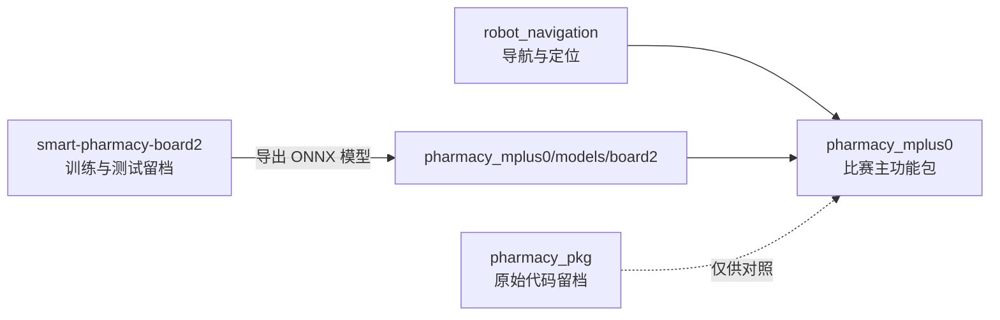

# Smart Pharmacy

本仓库用于保存智慧药房双车协同比赛的 ROS 源代码、导航配置以及识别板二 YOLO 模型的训练留档。比赛主程序位于 `pharmacy_mplus0`，可以通过同一套代码分别部署到车 1 和车 2。

## 仓库组成

| 目录 | 定位 | 是否参与主程序运行 |
|---|---|---|
| `pharmacy_mplus0/` | 当前比赛主功能包，包含状态机、视觉、导航调度、双车通信和裁判通信 | 是 |
| `pharmacy_pkg/` | 未规范化的原始版本代码，用于历史对照 | 否 |
| `robot_navigation/` | 底盘、定位、路径规划和 `move_base` 启动配置 | 是，作为独立 ROS 功能包 |
| `smart-pharmacy-board2/` | 识别板二的数据处理、YOLO 训练、测试和结果留档 | 否，仅用于模型开发 |

运行时的代码边界如下：



`pharmacy_mplus0` 已包含运行所需的板二 ONNX 模型，不会在运行时导入或读取 `smart-pharmacy-board2`。主程序同样不依赖 `pharmacy_pkg` 中的任何代码或资源。

## 主功能包

`pharmacy_mplus0` 是 ROS1 功能包，负责以下比赛功能：

- 管理双车比赛状态机；
- 识别板一二维码并选择取样任务；
- 按 `C → A → B` 的顺序完成取样；
- 使用双 ONNX 模型识别板二状态和等待时间；
- 调用 `move_base` 完成识别点、取样窗口、化验窗口和起点之间的导航；
- 在两辆车之间传递任务令牌和板一完整结果；
- 向裁判服务器上报车辆位置、速度、任务和视觉结果；
- 根据比赛阶段播放取样、送样和等待语音。

详细架构、节点职责、话题和算法说明见 [`pharmacy_mplus0/README.md`](pharmacy_mplus0/README.md)。

## 比赛流程

车 1 默认先执行任务，车 2 等待车 1 释放任务令牌。单车一轮任务依次经过以下阶段：

1. 前往识别板一；
2. 读取四个二维码窗口并选择任务；
3. 前往需要访问的取样窗口；
4. 前往识别板二；
5. 根据识别结果等待或直接进入化验区；
6. 前往对应化验窗口完成送样；
7. 关闭本车裁判上报权，释放对车任务令牌；
8. 返回本车起点并等待下一轮。

车 2 优先复用车 1 发送的板一完整结果，在排除车 1 已选任务后重新选择本车任务；共享结果不可用时回退到本车视觉识别。

主控状态编号为：

| 编号 | 状态 | 含义 |
|---:|---|---|
| 8 | `WAIT_TURN` | 等待任务令牌 |
| 9 | `GO_TO_BOARD1` | 前往识别板一 |
| 10 | `BOARD1_RECOGNIZING` | 识别板一 |
| 11 | `GO_TO_PICKUP_WINDOWS` | 执行取样任务 |
| 12 | `GO_TO_BOARD2` | 前往识别板二 |
| 13 | `BOARD2_RECOGNIZING` | 识别板二 |
| 14 | `GO_TO_LAB_WINDOW` | 前往化验窗口 |
| 15 | `GO_BACK_HOME` | 返回本车起点 |

## 识别板二模型

板二采用两个 YOLO 分类模型：

- `status_best.onnx`：分类 `busy` 和 `idle`；
- `number_best.onnx`：分类等待时间 `5`～`10`。

模型训练与测试代码保存在 `smart-pharmacy-board2`，比赛运行副本保存在：

```text
pharmacy_mplus0/models/board2/status_best.onnx
pharmacy_mplus0/models/board2/number_best.onnx
```

板二处理流程为：黑框定位、内部白色区域二次对齐、固定 ROI 裁剪、白边补方、`224 × 224` 缩放、双模型推理和 5 帧概率滑动平均。

ROS 输出保持为：

- 空闲：`[0, 0]`；
- 忙碌：`[1, wait_time]`。

## 配置文件

主功能包的比赛参数集中在 `pharmacy_mplus0/config/`：

| 文件 | 内容 |
|---|---|
| `strategy.yaml` | 状态机时序、双车角色、窗口映射和语音映射 |
| `waypoints.yaml` | 导航航点、朝向索引和两车起点 |
| `vision.yaml` | 板一参数、板二模型参数、图像输入和相机地址 |
| `communication.yaml` | ROS 话题、双车 TCP 和裁判 TCP 参数 |

同一套代码通过 `CAR_ID=1` 或 `CAR_ID=2` 选择车辆身份。车辆编号决定初始任务状态、对车地址、本地端口、相机地址和板一共享策略。

网络地址、航点和相机 URL 均为比赛现场参数，部署前应与两辆车的实际网络和地图保持一致。

## 运行环境

主功能包面向以下环境：

- Ubuntu 18.04；
- ROS1 Melodic；
- Python 2.7；
- OpenCV、OpenCV DNN、NumPy；
- pyzbar/zbar；
- SoX `play`；
- Astra 摄像头及 `web_video_server`。

板二模型要求目标机 OpenCV 支持 `cv2.dnn.readNetFromONNX`。

## 构建

将运行所需的 ROS 功能包放入 Catkin 工作空间后构建：

```bash
cd ~/robot_ws
catkin_make
source devel/setup.bash
```

工作空间中至少需要包含：

```text
robot_ws/src/
├── pharmacy_mplus0/
└── robot_navigation/
```

`astra_camera`、`web_video_server` 及其他 ROS 系统依赖应由正式运行环境提供。

## 启动入口

完整比赛入口：

```bash
# 车 1
roslaunch pharmacy_mplus0 race_bringup.launch car_id:=1

# 车 2
roslaunch pharmacy_mplus0 race_bringup.launch car_id:=2
```

其他入口：

| Launch 文件 | 用途 |
|---|---|
| `base_camera_nav.launch` | 仅启动导航、摄像头和视频服务 |
| `main.launch` | 启动比赛业务节点 |
| `vision.launch` | 仅启动视觉识别节点 |
| `test_navigation.launch` | 测试单个配置航点 |

## 主要 ROS 接口

| 话题 | 类型 | 内容 |
|---|---|---|
| `/nav_state` | `std_msgs/Int32` | 当前比赛状态 |
| `/cam_return` | `std_msgs/Int32MultiArray` | 板一任务选择结果 |
| `/board2_return` | `std_msgs/Int32MultiArray` | 板二状态和等待时间 |
| `/board1_all_text` | `std_msgs/String` | 本车板一完整 JSON |
| `/dual_car/round_done` | `std_msgs/Int32MultiArray` | 本车完成轮次 |
| `/dual_car/peer_done` | `std_msgs/Int32MultiArray` | 对车完成轮次 |
| `/dual_car/peer_board1_all_text` | `std_msgs/String` | 对车板一完整 JSON |
| `/referee_task` | `std_msgs/String` | 裁判任务状态 |
| `/referee_cv1` | `std_msgs/String` | 板二裁判结果 |
| `/referee_cv2` | `std_msgs/String` | 板一裁判结果 |
| `/referee_active` | `std_msgs/Bool` | 本车裁判上报权 |

## 仓库目录

```text
Smart-Pharmacy/
├── pharmacy_mplus0/          # 当前比赛主功能包
├── pharmacy_pkg/             # 原始代码留档
├── robot_navigation/         # 导航功能包
├── smart-pharmacy-board2/    # 板二 YOLO 训练与测试留档
├── .gitignore
└── README.md
```

## 资源说明

两份板二 ONNX 模型已经包含在主功能包中。`pharmacy_mplus0/resources/audio/` 用于保存比赛语音；当前仓库中的该目录仅包含占位文件，部署语音功能前需要补齐与配置命名一致的 WAV 文件。
